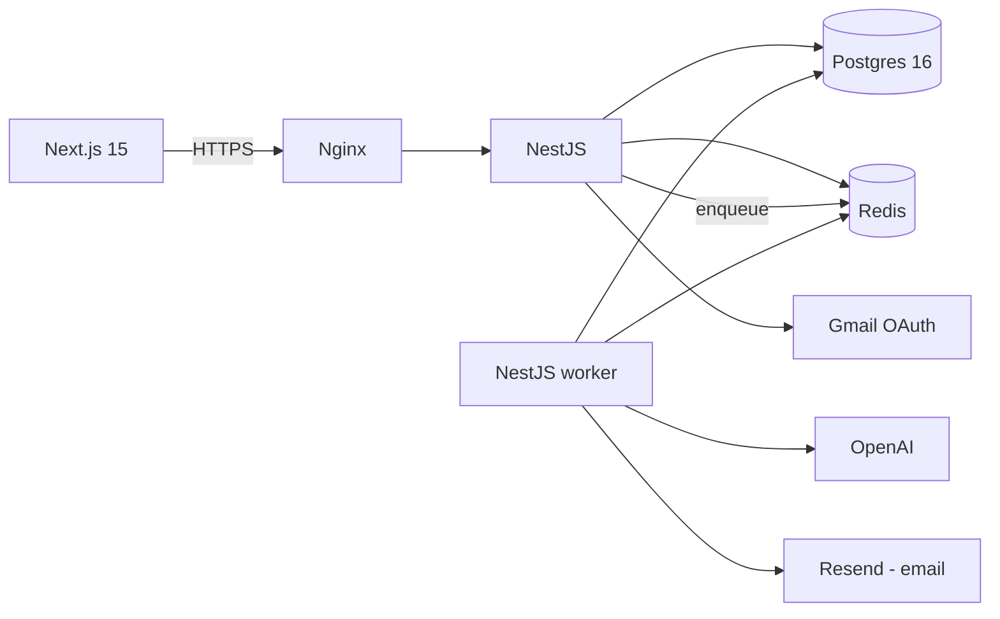

# Outflow

> See every subscription draining your account. Connect Gmail in 30 seconds — no bank password required.

[](#)
[](LICENSE)
[](#)
[](#)
[](#)

Outflow scans your inbox for subscription receipts, identifies recurring charges with vendor-specific parsers (with regex and LLM fallbacks), and **alerts you 3 days before each trial ends**. It catches duplicate services and silent price hikes — without ever asking for your bank credentials.

This README will grow with each phase. Right now we're at **Phase 1** — auth + a working manual subscription tracker. Sign up, log in, add subscriptions, see your monthly burn on the dashboard. Gmail auto-detection lands in Phase 2.

## Table of contents

- [Why this exists](#why-this-exists)
- [Features](#features)
- [Architecture at a glance](#architecture-at-a-glance)
- [Tech stack](#tech-stack)
- [Local development](#local-development)
- [Project structure](#project-structure)
- [Roadmap](#roadmap)
- [Honest disclosures](#honest-disclosures)
- [License](#license)

## Why this exists

Most people pay for forgotten trials, duplicate streaming services, and silent price hikes. Existing tools require sharing bank credentials (Rocket Money) or are manual-entry only (Bobby). Outflow finds subscriptions automatically by reading receipt emails — a simpler, safer, faster path to "what am I actually paying for?"

## Features

|                               |                                                                                                              |
| ----------------------------- | ------------------------------------------------------------------------------------------------------------ |
| **Gmail OAuth (read-only)**   | Connect once. Outflow only ever requests `gmail.readonly`.                                                   |
| **Vendor-aware parsers**      | Custom parsers for the top ~30 SaaS vendors (Netflix, Spotify, OpenAI, AWS, …).                              |
| **Regex + LLM fallback**      | Anything our parsers don't recognize falls back to regex, then a budgeted LLM call (cached by content hash). |
| **Trial-end alerts**          | We notify you **3 days before** any trial converts to paid.                                                  |
| **Duplicate detection**       | Two streaming services? Two cloud notepads? We surface them.                                                 |
| **Price-hike detection**      | Spotify quietly raised your bill? You'll know.                                                               |
| **Manual entry + CSV import** | Use Outflow without Gmail at all.                                                                            |
| **Polished web app**          | Next.js 15, Tailwind, dark mode, full keyboard nav, A+ Lighthouse a11y.                                      |

## Architecture at a glance



See [`docs/ARCHITECTURE.md`](docs/ARCHITECTURE.md) (Phase 7) for the full deep-dive.

## Tech stack

This project is also a learning resource. **Every tool below has a one-paragraph explanation in [`docs/LEARNING.md`](docs/LEARNING.md)** — what it is, why we picked it, and the senior-engineer concept it teaches.

- **Frontend:** Next.js 15 (App Router), React 19, TypeScript, Tailwind CSS, shadcn/ui, TanStack Query, Zustand
- **Backend:** NestJS 10, TypeScript, Prisma ORM, BullMQ (Redis), class-validator, Zod, Helmet, Pino
- **Database:** PostgreSQL 16 (with `citext`, `pg_trgm`, `pgcrypto`, `pgvector`)
- **Cache & queues:** Redis 7
- **AI:** OpenAI API (LLM fallback parser, budgeted)
- **Auth:** JWT (access + rotating refresh), Google OAuth, TOTP 2FA, Argon2id
- **Email:** Resend + React Email
- **Billing:** Stripe Checkout + Customer Portal + webhooks
- **Tooling:** pnpm workspaces, Turborepo, ESLint 9 (flat config), Prettier, Husky, lint-staged, commitlint
- **Containers:** Docker, docker-compose (dev), distroless multi-stage images (prod)
- **Observability:** Pino logs → Loki, Prometheus metrics → Grafana, OpenTelemetry traces → Tempo, Sentry errors
- **CI/CD:** GitHub Actions (lint, typecheck, test, build, security scan, deploy)
- **Hosting:** DigitalOcean droplet behind Nginx with Let's Encrypt

## Local development

First boot (one-time setup):

```bash
# 1. Node 22+ via nvm if you have it, plus pnpm via corepack
nvm use                                            # picks up .nvmrc
corepack enable && corepack prepare pnpm@9.15.0 --activate

# 2. Install workspace dependencies
pnpm install

# 3. Boot Postgres, Redis, Mailhog, MinIO
cp .env.example .env
docker compose -f docker-compose.dev.yml up -d

# 4. Apply DB migrations + seed categories
pnpm --filter @outflow/api exec prisma migrate deploy
pnpm --filter @outflow/api exec prisma db seed

# 5. Run dev servers
pnpm dev
# → API:  http://localhost:4000   (docs at /docs in non-production)
# → Web:  http://localhost:3000
```

After that, every-day workflow is:

```bash
docker compose -f docker-compose.dev.yml up -d   # if not already running
pnpm dev
```

Useful single-app commands:

```bash
pnpm --filter @outflow/api dev          # API only, with watch mode
pnpm --filter @outflow/web dev          # web only
pnpm --filter @outflow/api exec prisma studio   # GUI for the DB
pnpm --filter @outflow/api test                  # API unit tests
pnpm typecheck && pnpm lint && pnpm test         # everything
```

## What works today (Phase 1)

| Flow              | URL              | Behaviour                                                                                   |
| ----------------- | ---------------- | ------------------------------------------------------------------------------------------- |
| Marketing landing | `/`              | Anonymous: sign-up CTA. Logged-in: redirects to `/dashboard`.                               |
| Sign up           | `/signup`        | Creates user, hashes password with Argon2id, sets httpOnly cookies, redirects to dashboard. |
| Log in            | `/login`         | Session cookie + rotating refresh token.                                                    |
| Dashboard         | `/dashboard`     | Live monthly spend, annualised total, top categories, upcoming charges.                     |
| Subscriptions     | `/subscriptions` | Add / edit / pause / cancel / delete (soft).                                                |
| Settings          | `/settings`      | Profile read-only, log-out button.                                                          |

API endpoints (Swagger UI at `http://localhost:4000/docs`):

- `POST /api/v1/auth/signup` · `POST /api/v1/auth/login` · `POST /api/v1/auth/refresh` · `POST /api/v1/auth/logout` · `GET /api/v1/auth/me`
- `GET /api/v1/subscriptions` · `POST /api/v1/subscriptions` · `GET/PATCH/DELETE /api/v1/subscriptions/:id` · `PATCH /api/v1/subscriptions/:id/status`
- `GET /api/v1/categories`
- `GET /api/v1/insights/summary`
- `GET /health/{live,ready,version}`

## Project structure

```
outflow/
├── apps/
│   ├── api/                     # NestJS backend (modules + workers)
│   │   ├── prisma/              # Prisma schema + migrations
│   │   └── src/
│   └── web/                     # Next.js 15 frontend
│       └── src/app/             # App Router routes
├── packages/
│   ├── contracts/               # Shared Zod schemas + TS types
│   └── ui/                      # Shared shadcn-style components
├── infra/
│   └── postgres/init/           # SQL run on first boot of the postgres volume
├── docs/
│   ├── LEARNING.md              # Why each tool was chosen + what it teaches
│   ├── STACK.md                 # Stack overview & decision log
│   ├── ARCHITECTURE.md          # (Phase 7) Full architecture deep-dive
│   └── adr/                     # Architectural Decision Records
├── docker-compose.dev.yml
├── turbo.json
├── pnpm-workspace.yaml
└── README.md
```

## Roadmap

Phase-by-phase plan lives in [`docs/ROADMAP.md`](docs/ROADMAP.md). Current: **Phase 0 (setup) — done**. Next: Phase 1 (auth + account foundation).

## Honest disclosures

- **Gmail OAuth scope is restricted.** `gmail.readonly` is in Google's "Restricted Scope" tier. Until we complete Google's CASA verification, the app can serve only up to 100 OAuth test users. The app works fully — the limit is a Google policy thing, not a product limit. The CASA process is documented in `docs/runbooks/casa-prep.md` (Phase 7).
- **LLM costs are budgeted per user.** The LLM fallback parser is rate-limited (free: 50 calls/month, pro: 5K). Vendor parsers + regex catch the vast majority — LLM is the long-tail safety net.
- **No bank credentials.** Outflow does not integrate with Plaid or any bank API in v1. Detection is email-receipt based.

## License

MIT — see [LICENSE](LICENSE).
